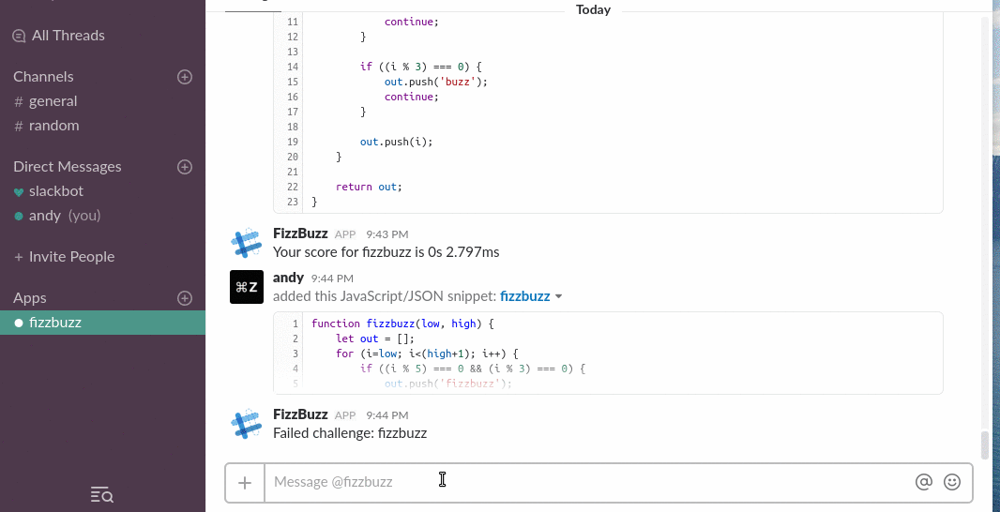
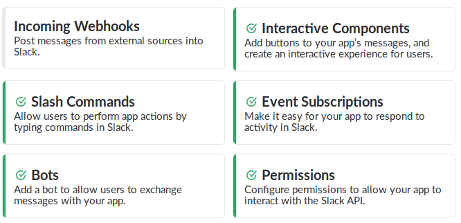

# FizzBuzz Slack Bot

Code challenges for Slack built on a Webtask backend

Use and deploy at your own risk.  While I used VM2 instead of `eval()` 
in order to avoid many of the dangers of `eval()`, I'm sure there are possible security vulnerabilities. 

## Installation

* [Install Webtask](https://webtask.io/docs/wt-cli)
    * `npm install wt-cli -g`
    * `wt init <your-email>`
* Install Typescript
    * `npm install -g typescript`
    
* Install dependencies
    * `npm install`
    
* Deploy
    * `npm run create`

(There's probably something missing here)    

## Setup

There's a few things to setup once the webtask has been deployed. 

* Add a `fizzbuzz` bot to your app
* Add a `/fizzbuzz` slash command
    * Request URL: `https://<domain>/slash`
* Add an event request url: `https://<domain>/events` Along with the `message.im` perms
* Add an interactive component
    *  Request url: `https://<domain>/interactive`
* Copy the values from the OAuth + Permissions pane and put them in the `.env` file

## Development

* `tsc` to compile Typescript into Javascript. Jetbrains IDEs will also do this for you.
* `npm run serve` to develop locally 
* `npm create` to create and bundle the index Webtask function
